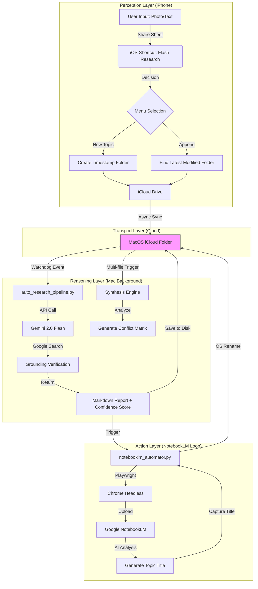

# 🐿️ FlashSquirrel (閃電松鼠) - Automated Research Pipeline

> **「感知即認知，讓知識自動代謝。」**  
> *"Perception is Cognition. Let your knowledge metabolize automatically."*

[繁體中文](#繁體中文) | [English](#english)

---

## 💡 核心哲學 (The Manifesto)

### 1. 深度先於廣度 (Deepen, then Synthesize)
先透過 Gemini 進行深度文獻研發，自動補足數據與查證，再將高含金量報告餵給 NotebookLM 歸檔與代謝。

### 2. 時間套利 (Time Arbitrage)
每天節省的手動處理時間約為 5 小時，每月累計節省約 150 小時。讓 AI 負責繁複的勞力，您負責最終的決策。

### 3. 金錢守護者 (Cost Guardian) 🛡️
系統內建實時費用監控，每次處理均會產出 Token 使用量與美金費用預估，確保 API 消費透明可控。

### 4. 故障自我修復 (Auto-Repair Architecture) ☁️
具備 iCloud 佔位符智能識別、API 流量限制自動對沖與異步隊列管理。系統在不穩定的網路與雲端環境中依舊能保持硬化運行。

---

## 🛠️ 系統架構 (System Architecture)

*(詳見 [系統架構手冊](./系統架構手冊.md))*

---

## 🚀 快速開始 (Quick Start)

### 🏁 極簡安裝步驟
**如果您希望以最快速度啟動閃電工作流，請按照以下步驟操作：**

1.  **下載與解壓縮**：點擊右上角綠色按鈕 **"Code"** 並選擇 **"Download ZIP"**。
2.  **一鍵配置大腦**：
    - 前往 [Google AI Studio 獲取 API Key](https://aistudio.google.com/app/apikey)。
    - 雙擊執行資料夾中的 `setup_wizard.py`，貼上您的金鑰並完成 Google 登入。
3.  **啟動同步**：[下載 iOS 快捷指令](https://www.icloud.com/shortcuts/b7238297c2494f73addcd1b7330bdebf) 並將檔案放入 iCloud 或任何同步資料夾中。

---

## 🛠️ 全平台同步方案 (Cross-Platform Sync)
*   **Apple 用戶**：利用 iOS 快捷指令與 iCloud Drive 實現無感同步。
*   **Windows / Android 用戶**：
    - **雲端同步**：支援 OneDrive、Google Drive、Dropbox 或官方 iCloud for Windows。
    - **通用方案**：任何能將手機檔案「同步至電腦資料夾」的工具（如 Telegram 目錄映射）均可啟動閃電工作流。

---

## ⚖️ 授權與企業使用 (License & Corporate)

本專案採 **AGPLv3** 協議開源。企業如有商業化需求或涉及 MCP 格式大規模應用，請務必先與作者聯繫說明。

詳見 [生活化流程手冊](./docs/LIFESTYLE_WORKFLOW.md) 與 [系統架構手冊](./系統架構手冊.md)。

---

## 💡 The Manifesto

### 1. Deepen, then Synthesize
Utilize Gemini for deep academic research to supplement data and verify facts, then feed high-value reports into NotebookLM for archiving and synthesis.

### 2. Time Arbitrage
Saves approximately 5 hours of manual processing daily, totaling 150 hours per month. Let AI handle the heavy lifting while you focus on final decision-making.

### 3. Cost Guardian 🛡️
Built-in real-time cost monitoring. Every task logs precise token usage and USD cost estimations, ensuring transparent and controlled API spending.

### 4. Auto-Repair Architecture ☁️
Features intelligent iCloud placeholder detection, API rate limit hedging, and asynchronous queue management. The system remains robust across unstable network and cloud environments.

---

## 🚀 Quick Start

### 🏁 Minimal Setup Steps
**To launch your Flash Research workflow at light speed, follow these steps:**

1.  **Download**: Click the green **"Code"** button above and select **"Download ZIP"**.
2.  **Configure**:
    - Get your [Google AI Studio API Key here](https://aistudio.google.com/app/apikey).
    - Run `setup_wizard.py`, paste your key, and complete the Google login.
3.  **Sync**: [Download the iOS Shortcut here](https://www.icloud.com/shortcuts/b7238297c2494f73addcd1b7330bdebf).

---

## 🛠️ Universal Sync Solutions
*   **Apple Users**: Seamless synchronization via iOS Shortcuts and iCloud Drive.
*   **Windows / Android Users**:
    - **Cloud Options**: Supports OneDrive, Google Drive, Dropbox, or iCloud for Windows.
    - **Universal**: Any tool that syncs mobile files to a local PC folder can trigger the pipeline.

---

## ⚖️ License & Corporate Usage

Licensed under **AGPLv3**. For commercial use or large-scale MCP integration, please contact the author beforehand.

See [Lifestyle Workflow Guide](./docs/LIFESTYLE_WORKFLOW.md) and [Technical Manual](./系統架構手冊.md) for more details.
