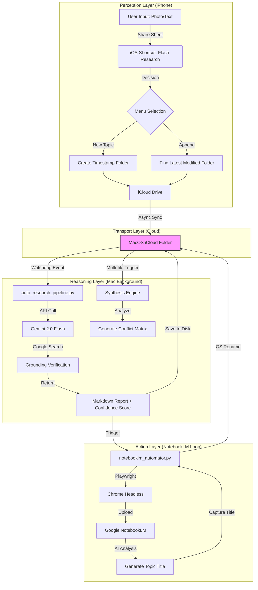

# 🐿️ FlashSquirrel (閃電松鼠) - Automated Research Pipeline

[繁體中文](#繁體中文) | [English](#english)

---

## 💡 核心哲學 (The Manifesto)

### 1. 深度先於廣度 (Deepen, then Synthesize)
目前的 AI 工具存在兩個極端：
*   **Gemini/ChatGPT**: 廣度極高，能聯網查證 80% 的公開知識，但知識管理困難（對話串難以回溯）。
*   **NotebookLM**: 收斂能力極強（做 Podcast、心智圖、影片），但**「輸入即輸出」**，來源淺則筆記淺。

**本專案的解法**：
建立一座橋樑。先用 Gemini **「深度研發」** 你的原始素材（補足 IEEE 文獻、查證數據），再把這份**「加料後的高含金量報告」** 自動餵給 NotebookLM 進行歸檔。

### 2. 時間套利 (Time Arbitrage)
*   **手動成本**：手動跑一份深度報告 + 整理 + 上傳歸檔 = 約 30 分鐘。
    *   每天 20 份 = 消耗 **5 小時/天**。
    *   每月 = 消耗 **150 小時/月**。
*   **自動化成本**：
    *   Gemini API 費用：約 **$3 USD / 月**。
    *   你的時間：**0 秒**。

**結論**：用 3 美金買回 150 小時的生命，這是無限大的投資報酬率。

### 3. API 方案選擇 (API Tiers)
*   **免費版 (Free of Charge)**：適合輕量使用。優點是完全免費；缺點是有速率限制（Rate Limit），檔案多時需要「排隊」等待 API 恢復。
*   **付費版 (Pay-as-you-go)**：適合重度研究。優點是極速、穩定且幾乎不需等待；缺點是需按量計費，但如前所述，一般研究用途每月僅約 $3 USD。

### 4. 使用者情境 (User Personas)
*   **跨領域研究生**：需要快速理解非本專業的技術文獻，並建立跨學科的知識聯結。
*   **市場分析師**：每日需處理大量行業報告，並尋找其中的矛盾點與潛在趨勢。
*   **硬核知識愛好者**：希望將零散的網頁剪輯與隨筆，自動整理成系統化的電子書或筆記。

---

## 🛠️ 系統架構 (System Architecture)

*(詳見 [系統架構手冊 (Architecture Manual)](./系統架構手冊.md))*

---

## 🚀 快速開始 (Quick Start)

### 👶 對於非技術用戶 (律師、研究員、文科生)
**如果您不知道什麼是 GitHub，請按照以下三個步驟操作：**

1.  **下載專案**：點擊右上角的綠色按鈕 **"Code"**，選擇 **"Download ZIP"**，下載後解壓縮。
2.  **配置大腦**：
    - 去 [Google AI Studio (在此獲取免費 API Key)](https://aistudio.google.com/app/apikey) 拿一張通行證（API Key）。
    - 打開資料夾，雙擊執行 `setup_wizard.py` (Windows 用戶可直接將檔案拖入命令提示字元)。
    - **貼上 API Key**，然後按照畫面提示登入你的 Google 帳號（為了 NotebookLM）。
3.  **手機同步**：[點此下載 iOS 快捷指令](https://www.icloud.com/shortcuts/b7238297c2494f73addcd1b7330bdebf) (請將檔案丟入 iCloud 中的 `研究工作流` 資料夾)。

---

## ⚖️ 授權與企業使用 (License & Corporate)

### 開源協議
本專案採用 **AGPLv3** (GNU Affero General Public License v3) 協議開源。

### 企業使用規範
*   **事先說明**：企業如有商業使用需求或基於本專案開發產品（特別是涉及 Appigee V3 / AGL V3），請務必先與作者聯繫說明。
*   **格式相容性**：
    - 請確認您的系統是否可以轉換成 **MCP 格式** (Model Context Protocol)。
    - 若無法轉換，請及時與作者溝通以尋求解決方案。

---

## 💡 The Manifesto

### 1. Deepen, then Synthesize
Current AI tools often suffer from two extremes:
*   **Gemini/ChatGPT**: Broad knowledge verified via web search, but difficult for knowledge management (hard to recall specific dialogue threads).
*   **NotebookLM**: Excellent synthesis (podcasts, mind maps, slides), but operates on an "**Input Equals Output**" basis—shallow sources lead to shallow notes.

**Our Solution**:
We build a bridge. Use Gemini for **"Deep Research"** on your raw materials (supplementing with IEEE citations, verifying data), then automatically feed this "**high-value enhanced report**" into NotebookLM for final synthesis and storage.

### 2. Time Arbitrage
*   **Manual Cost**: Manually running a deep report + organizing + uploading = ~30 minutes.
    *   20 reports/day = **5 hours/day**.
    *   Per month = **150 hours/month**.
*   **Automated Cost**:
    *   Gemini API Cost: ~**$3 USD/month**.
    *   Your Time: **0 seconds**.

**Conclusion**: Buying back 150 hours of your life for $3 is an infinite ROI.

### 3. API Tier Selection
*   **Free Tier**: Best for light usage. Pros: Fully free. Cons: Rate limits apply; you'll have to "wait in line" when processing large volumes of files.
*   **Paid Tier (Pay-as-you-go)**: Best for serious research. Pros: High speed, reliable, no waiting. Cons: Billed by usage, though average research cost is only ~$3 USD/month.

### 4. User Personas
*   **Interdisciplinary Researchers**: Rapidly understand technical literature outside their primary field and bridge knowledge gaps.
*   **Market Analysts**: Process high volumes of industry reports daily to find contradictions and emerging trends.
*   **Hardcore Knowledge Seekers**: Automatically organize scattered web clippings and notes into a systematic knowledge base.

---

## 🛠️ Usage Instructions (Architecture Above 👆)

### 👶 For Non-Tech Users (Lawyers, Researchers, Students)
**If you're not a developer, follow these three simple steps:**

1.  **Download**: Click the green **"Code"** button above, select **"Download ZIP"**, and extract the file.
2.  **Configure**:
    - Get your API Key from [Google AI Studio (Get your free API Key here)](https://aistudio.google.com/app/apikey).
    - Open the folder, run `setup_wizard.py` (Windows users can drag the file into Command Prompt).
    - **Paste your API Key** and follow the prompts to log in (for NotebookLM sync).
3.  **Sync Mobile**: [Download the iOS Shortcut here](https://www.icloud.com/shortcuts/b7238297c2494f73addcd1b7330bdebf) (Drop files into the `Research Workflow` folder in iCloud).

---

## ⚖️ License & Corporate Usage

### Open Source License
This project is licensed under **AGPLv3** (GNU Affero General Public License v3).

### Corporate Usage Guidelines
*   **Prior Notification**: Any commercial use or product development based on this project (especially those involving Appigee V3 / AGL V3) must be communicated to the author beforehand.
*   **Format Compatibility**:
    - Ensure your system can convert to **MCP format** (Model Context Protocol).
    - If conversion is not possible, please contact the author for a solution.

---

> *"The computer should do the work, you should do the thinking."*
