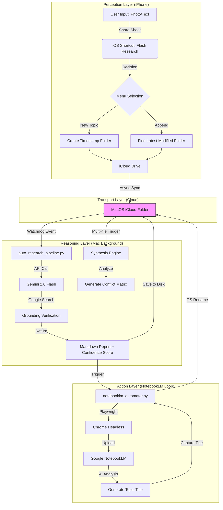

# 🐿️ FlashSquirrel (閃電松鼠) - Automated Research Pipeline

> **「閃電一擊，智慧入林。」**  
> *"One Lightning Strike, A Forest of Wisdom."*

[繁體中文](#繁體中文) | [English](#english)

---

## ✨ 報告規格 (Report Capabilities)
*   **多語言支持**：完美處理 **繁體中文** 與 **英文** 資料，產出高品質雙語報告。
*   **格式標準**：全自動生成 **Markdown** 檔案，方便您匯入 Obsidian, Notion 或任何筆記軟體。
*   **分析模式**：
    - **單點模式 (Single Point)**：針對單個文件進行深度查證與摘要。
    - **多點模式 (Multi-Point)**：自動偵測多份文件，產出「爭議矩陣」與「綜合綜述」。

---

## 💡 核心哲學 (The Manifesto)

### 1. 深度先於廣度 (Deepen, then Synthesize)
**解決 AI 的「香農熵 (Entropy)」問題**：
根據香農資訊理論，資訊在傳遞中會產生損耗（噪音）。AI 在處理過於龐大、未經整理的資料庫時，回覆會變得「零散」且「準確度下降」。

**FlashSquirrel 的解法**：
拒絕直接將垃圾塞入 AI。我們利用 **Markdown 結構化報告** 作為資訊濾波器：先透過 Gemini 2.0 進行「高能量過濾」與「深度研發」，將雜亂的原始訊號轉化為高密度的結構化報告，再餵給 NotebookLM。這能確保您的知識庫永遠保持「低熵 (Low Entropy)」且高度精確。

### 2. 時間套利 (Time Arbitrage)
每天節省的手動處理時間約為 5 小時，每月累計節省約 150 小時。讓 AI 負責繁複的勞力，您負責最終的決策。

### 3. 金錢守護者 (Cost Guardian) 🛡️
我們不只說便宜，我們算給你看。您可以根據需求自由選擇方案：

| 方案 | 生成品質 | 等待時間 | 費用 | 特色 |
| :--- | :--- | :--- | :--- | :--- |
| **免費方案 (Free)** | **最高** | 較長 (需排隊) | **$0** | 系統內建「自動排隊」機制，掛著就能跑，0 成本無痛研究。 |
| **付費方案 (Paid)** | **最高** | **極速** | 約 $1~$3 /月 | 隨點隨用，毫秒級響應，用一杯咖啡的錢買回一個月的自由。 |

#### 📊 真實費率試算 (以 Gemini 2.0 Flash 為例)：

| 項目 (以單份深度報告計) | 預估使用量 | 單位成本 (1M tokens) | 小計 |
| :--- | :--- | :--- | :--- |
| **輸入 (Input)** | 10,000 tokens | $0.10 | $0.0010 |
| **輸出 (Output)** | 2,000 tokens | $0.40 | $0.0008 |
| **單份研究總計** | - | - | **$0.0018 USD** |

*   **規模化運算**：即便每天處理 20 份報告，每月費用僅約 **$1.08 USD** (約 35 元台幣)。
*   **結論**：無論免費或付費，FlashSquirrel 都會在後台幫您處理好排隊與更名，您只需要負責「投餵」即可。

### 4. 故障自我修復 (Auto-Repair Architecture) ☁️
具備 iCloud 佔位符智能識別、API 流量限制自動對沖與異步隊列管理。系統在不穩定的網路與雲端環境中依舊能保持硬化運行。

---

## 🛠️ 系統架構 (System Architecture)

*(詳見 [系統架構手冊](./系統架構手冊.md))*

---

## 🚀 選擇您的研究靈魂 (Choose Your Experience)

為了適應不同使用習慣，我們提供兩種自動化層級：

### 🏁 模式 A：半自動模式 (Semi-Auto: Active Patrol)
**適合：** 初學者、臨時研究者、或是想看到松鼠正在工作的安全感。
1.  **啟動**：執行 `python start.py`。
2.  **體驗**：螢幕會出現一個終端機黑框（巡邏模式），只要視窗不關，所有的手機上傳都會自動處理。
3.  **注意**：電腦重啟後需要手動再點一次。

### 🛡️ 模式 B：全自動模式 (Full-Auto: Invisible Shield)
**適合：** 專業研究員、追求「掀開螢幕即完成」的極致體驗。
1.  **啟動**：執行 `python scripts/setup_background.py`。
2.  **體驗**：**完全沒有視窗**。松鼠會化為隱形守護進程，電腦開機即自動守護資料夾。
3.  **優勢**：真正達成「手機丟檔案 -> 筆記本見」

---

## 🛠️ 三種使用路徑 (Three Usage Paths)

### 1. 純電腦使用者 (Desktop Only)
1.  **自動生成**：首次執行 `start.py` 後，系統會自動在專案目錄下建立 `data/input_thoughts` 資料夾。
2.  **管理素材**：將文件（PDF、照片）放入子資料夾，AI 將自動完成本地分析。

### 2. Apple 全家桶用戶 (Apple Ecosystem)
1.  **環境配置**：在 iCloud Drive 中確保有一個名為 **`研究工作流`** 的資料夾（名稱必須完全一致，以匹配 iOS 捷徑）。
2.  **一鍵啟動**：執行 `python start.py` 並直接按 **Enter** 確認預設路徑。
3.  **啟動同步**：[下載 iOS 快捷指令](https://www.icloud.com/shortcuts/b7238297c2494f73addcd1b7330bdebf) 並將檔案（照片、網頁、PDF）存入該資料夾。
4.  **自動化**：手機上傳，Mac 在後台自動執行研發與更名。

> [!IMPORTANT]
> **💡 常見問題與技術說明 (FAQ & Tech Notes)**
> *   **資料夾生成**：只要執行 `start.py` 並按下 **Enter**，系統就會自動在您的 iCloud 中變出完整結構。建議先手動建立「研究工作流」主目錄以供移動端即時存入。
> *   **同步響應時間**：請確認您已開啟 **「完全磁碟取用權限 (Full Disk Access)」**（至系統設定 -> 隱私與安全性 -> 將「終端機 Terminal」勾選為開啟）。**設定完成後請重啟終端機視窗**。iCloud 指令同步至電腦約需 5-30 秒之響應時間。

### 3. Windows / 跨平台組合 (Windows & Cross-Platform)
1.  **同步媒介**：在 Windows 安裝 **iCloud for Windows** 或使用 **OneDrive**。
2.  **後台監控**：手機將檔案同步至雲端資料夾，FlashSquirrel 將在 Windows 上自動完成處理。

---

## 🛠️ 全平台同步方案 (Sync Strategy)
*   **Apple 用戶**：利用 iOS 快捷指令與 iCloud Drive 實現無感同步。
*   **Windows / Android 用戶**：
    - **雲端同步**：支援 OneDrive、Google Drive、Dropbox 或官方 iCloud for Windows。
    - **通用方案**：任何能將手機檔案「同步至電腦資料夾」的工具（如 Telegram 目錄映射）均可啟動閃電工作流。

---

## ⚖️ 授權與企業使用 (License & Corporate)

本專案採 **AGPLv3** 協議開源。企業如有商業化需求或涉及 MCP 格式大規模應用，請務必先與作者聯繫說明。

詳見 [常問問題 (FAQ)](./docs/FAQ.md)、[生活化流程手冊](./docs/LIFESTYLE_WORKFLOW.md) 與 [系統架構手冊](./系統架構手冊.md)。

## ✨ Report Capabilities
*   **Multilingual Support**: Masterfully handles **Traditional Chinese** and **English** to produce high-quality bilingual reports.
*   **Standard Format**: Fully automated **Markdown** files, compatible with Obsidian, Notion, or any note-taking software.
*   **Analysis Modes**:
    - **Single Point**: In-depth verification and summary for a single document.
    - **Multi-Point**: Automatically detects multiple files to produce "Conflict Matrices" and "Integrative Overviews."

---

## 💡 The Manifesto

### 1. Deepen, then Synthesize
**Solving the "Shannon Entropy" Problem**:
According to Shannon's Information Theory, information loss (noise) occurs during transmission. When AI processes an unorganized, massive database, its responses become "scattered" and "less accurate."

**The FlashSquirrel Solution**:
We refuse to feed raw "noise" into the AI. We use **Markdown-structured reports** as an information filter. By using Gemini 2.0 for "High-Energy Filtering" and "Deep Research," we transform chaotic raw signals into high-density structured reports before they reach NotebookLM. This ensures your knowledge base remains in a "Low Entropy" state with maximum precision.

### 2. Time Arbitrage
Saves approximately 5 hours of manual processing daily, totaling 150 hours per month. Let AI handle the heavy lifting while you focus on final decision-making.

### 3. Cost Guardian 🛡️
We don't just claim it's cheap; we prove it. Choose the plan that fits your pace:

| Plan | Quality | Wait Time | Cost | Key Feature |
| :--- | :--- | :--- | :--- | :--- |
| **Free Plan** | **Best** | Longer (Queue) | **$0** | Built-in "Auto-Queuing"—set it and forget it for $0 research. |
| **Paid Plan** | **Best** | **Ultra-Fast** | ~$1-$3 /mo | Millisecond responses; buy back your time for the price of a coffee. |

#### 📊 Realistic Cost Breakdown (Gemini 2.0 Flash):

| Item (Per Deep Report) | Est. Usage | Unit Cost (per 1M) | Subtotal |
| :--- | :--- | :--- | :--- |
| **Input** | 10,000 tokens | $0.10 | $0.0010 |
| **Output** | 2,000 tokens | $0.40 | $0.0008 |
| **Total per Report** | - | - | **$0.0018 USD** |

*   **Scaled Usage**: Even at 20 reports/day, your monthly cost is only ~$1.08 USD.
*   **Verdict**: Whether Free or Paid, FlashSquirrel handles all queuing and renaming in the background. You just feed the files.

### 4. Auto-Repair Architecture ☁️
Features intelligent iCloud placeholder detection, API rate limit hedging, and asynchronous queue management. The system remains robust across unstable network and cloud environments.

---

## 🚀 Choose Your Experience

To fit different workflows, we offer two tiers of automation:

### 🏁 Mode A: Semi-Automatic (Active Patrol)
**Best for:** Beginners or those who want the visible security of seeing the "Squirrel" at work.
1.  **Start**: Run `python start.py`.
2.  **Experience**: A terminal window stays open (Patrol Mode). As long as it's open, all mobile uploads are processed automatically.
3.  **Note**: Requires a manual re-start after a computer reboot.

### 🛡️ Mode B: Full-Automatic (Invisible Shield)
**Best for:** Professional researchers seeking a "flip the lid and it's done" experience.
1.  **Start**: Run `python scripts/setup_background.py`.
2.  **Experience**: **Completely invisible**. FlashSquirrel becomes a background system service that guards your folders automatically upon login.
3.  **Benefit**: Realize the "Mobile Drop -> NotebookLM" miracle with zero friction.

---

## 🛠️ Three Usage Paths

### 1. Desktop Only
1.  **Auto-Creation**: After running `start.py`, the system automatically creates the `data/input_thoughts` folder.
2.  **Direct Drop**: Place your files into sub-folders. AI handles all analysis locally.

### 2. Apple Ecosystem
1.  **Environment**: Ensure you have a folder named **`研究工作流`** in your iCloud Drive (The name must match the iOS Shortcut exactly).
2.  **One-Word Start**: Run `python start.py` and press **Enter** to confirm the default path.
3.  **Syncing**: [Download the iOS Shortcut](https://www.icloud.com/shortcuts/b7238297c2494f73addcd1b7330bdebf) and share files (photos, web, PDFs) to that folder.
4.  **iCloud Automation**: Captured on iPhone; processed and renamed automatically on your Mac.

> [!IMPORTANT]
> **💡 FAQ & Technical Notes**
> *   **Folder Generation**: Simply run `start.py` and press **Enter**; the system will auto-generate the structure in your iCloud. We recommend creating the main "研究工作流" folder first for immediate mobile use.
> *   **Sync Latency**: Ensure you have enabled **"Full Disk Access"** for your **Terminal** app (System Settings -> Privacy & Security). **Restart your Terminal after enabling this.** iCloud sync typically has a 5-30s response time.

### 3. Windows & Cross-Platform
1.  **Bridge**: Install **iCloud for Windows** or use **OneDrive/Google Drive**.
2.  **Auto-Sync**: `start.py` handles folder creation. Once files sync from mobile to cloud, FlashSquirrel picks them up automatically.

---

## 🛠️ Universal Sync Solutions
*   **Apple Users**: Seamless synchronization via iOS Shortcuts and iCloud Drive.
*   **Windows / Android Users**:
    - **Cloud Options**: Supports OneDrive, Google Drive, Dropbox, or iCloud for Windows.
    - **Universal**: Any tool that syncs mobile files to a local PC folder can trigger the pipeline.

---

## ⚖️ License & Corporate Usage

Licensed under **AGPLv3**. For commercial use or large-scale MCP integration, please contact the author beforehand.

See [Lifestyle Workflow Guide](./docs/LIFESTYLE_WORKFLOW.md) and [Technical Manual](./系統架構手冊.md) for more details.
