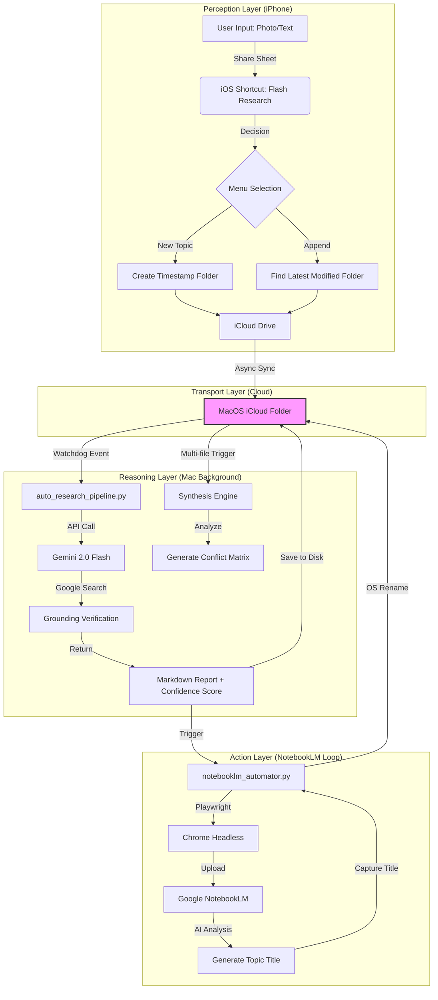

# 🐿️ FlashSquirrel (閃電松鼠) - Automated Research Pipeline

> **「閃電一擊，智慧入林。」**  
> *"One Lightning Strike, A Forest of Wisdom."*

[繁體中文](#繁體中文) | [English](#english)

---

## ✨ 報告規格 (Report Capabilities)
*   **多語言支持**：完美處理 **繁體中文** 與 **英文** 資料，產出高品質雙語報告。
*   **格式標準**：全自動生成 **Markdown** 檔案，方便您匯入 Obsidian, Notion 或任何筆記軟體。
*   **分析模式**：
    - **單點模式 (Single Point)**：針對單個文件進行深度查證與摘要。
    - **多點模式 (Multi-Point)**：自動偵測多份文件，產出「爭議矩陣」與「綜合綜述」。

---

## 💡 核心哲學 (The Manifesto)

### 1. 深度先於廣度 (Deepen, then Synthesize)
**解決 AI 的「香農熵 (Entropy)」問題**：
根據香農資訊理論，資訊在傳遞中會產生損耗（噪音）。AI 在處理過於龐大、未經整理的資料庫時，回覆會變得「零散」且「準確度下降」。

**FlashSquirrel 的解法**：
拒絕直接將垃圾塞入 AI。我們利用 **Markdown 結構化報告** 作為資訊濾波器：先透過 Gemini 2.0 進行「高能量過濾」與「深度研發」，將雜亂的原始訊號轉化為高密度的結構化報告，再餵給 NotebookLM。這能確保您的知識庫永遠保持「低熵 (Low Entropy)」且高度精確。

### 2. 時間套利 (Time Arbitrage)
每天節省的手動處理時間約為 5 小時，每月累計節省約 150 小時。讓 AI 負責繁複的勞力，您負責最終的決策。

### 3. 金錢守護者 (Cost Guardian) 🛡️
系統內建實時費用監控，每次處理均會產出 Token 使用量與美金費用預估，確保 API 消費透明可控。

### 4. 故障自我修復 (Auto-Repair Architecture) ☁️
具備 iCloud 佔位符智能識別、API 流量限制自動對沖與異步隊列管理。系統在不穩定的網路與雲端環境中依舊能保持硬化運行。

---

## 🛠️ 系統架構 (System Architecture)

*(詳見 [系統架構手冊](./系統架構手冊.md))*

---

## 🚀 快速開始 (Quick Start)

### 🏁 極簡安裝步驟
**如果您希望以最快速度啟動閃電工作流，請按照以下步驟操作：**

1.  **下載與解壓縮**：點擊右上角綠色按鈕 **"Code"** 並選擇 **"Download ZIP"**。
2.  **一鍵配置大腦**：
    - 前往 [Google AI Studio 獲取 API Key](https://aistudio.google.com/app/apikey)。
    - 雙擊執行資料夾中的 `setup_wizard.py`，貼上您的金鑰並完成 Google 登入。
3.  **啟動同步**：[下載 iOS 快捷指令](https://www.icloud.com/shortcuts/b7238297c2494f73addcd1b7330bdebf) 並將檔案放入 iCloud 或任何同步資料夾中。

## 🛠️ 「手把手」使用指南 (Step-by-Step for Everyone)

**如果您已經完成安裝步驟，接下來只需要這樣做：**

1.  **找到資料夾**：
    - 打開您的 iCloud Drive。
    - 進入 `研究工作流` 資料夾，您會看到一個 `input_thoughts` 子目錄。
2.  **丟入素材**：
    - 只要把任何 PDF、照片或筆記**直接丟進一個子資料夾**（例如：新建一個資料夾叫 `輝達財報分析`）。
3.  **等待魔法**：
    - 幾分鐘後，系統會自動在同一個地方產出一個 `[深度報告].md`。
    - 下一次您再看，原本的資料夾名稱可能已經被 AI 改成了更精準的主題。

---

## 🛠️ 全平台同步方案 (Sync Strategy)
*   **Apple 用戶**：利用 iOS 快捷指令與 iCloud Drive 實現無感同步。
*   **Windows / Android 用戶**：
    - **雲端同步**：支援 OneDrive、Google Drive、Dropbox 或官方 iCloud for Windows。
    - **通用方案**：任何能將手機檔案「同步至電腦資料夾」的工具（如 Telegram 目錄映射）均可啟動閃電工作流。

---

## ⚖️ 授權與企業使用 (License & Corporate)

本專案採 **AGPLv3** 協議開源。企業如有商業化需求或涉及 MCP 格式大規模應用，請務必先與作者聯繫說明。

詳見 [生活化流程手冊](./docs/LIFESTYLE_WORKFLOW.md) 與 [系統架構手冊](./系統架構手冊.md)。

## ✨ Report Capabilities
*   **Multilingual Support**: Masterfully handles **Traditional Chinese** and **English** to produce high-quality bilingual reports.
*   **Standard Format**: Fully automated **Markdown** files, compatible with Obsidian, Notion, or any note-taking software.
*   **Analysis Modes**:
    - **Single Point**: In-depth verification and summary for a single document.
    - **Multi-Point**: Automatically detects multiple files to produce "Conflict Matrices" and "Integrative Overviews."

---

## 💡 The Manifesto

### 1. Deepen, then Synthesize
**Solving the "Shannon Entropy" Problem**:
According to Shannon's Information Theory, information loss (noise) occurs during transmission. When AI processes an unorganized, massive database, its responses become "scattered" and "less accurate."

**The FlashSquirrel Solution**:
We refuse to feed raw "noise" into the AI. We use **Markdown-structured reports** as an information filter. By using Gemini 2.0 for "High-Energy Filtering" and "Deep Research," we transform chaotic raw signals into high-density structured reports before they reach NotebookLM. This ensures your knowledge base remains in a "Low Entropy" state with maximum precision.

### 2. Time Arbitrage
Saves approximately 5 hours of manual processing daily, totaling 150 hours per month. Let AI handle the heavy lifting while you focus on final decision-making.

### 3. Cost Guardian 🛡️
Built-in real-time cost monitoring. Every task logs precise token usage and USD cost estimations, ensuring transparent and controlled API spending.

### 4. Auto-Repair Architecture ☁️
Features intelligent iCloud placeholder detection, API rate limit hedging, and asynchronous queue management. The system remains robust across unstable network and cloud environments.

---

## 🚀 Quick Start

### 🏁 Minimal Setup Steps
**To launch your Flash Research workflow at light speed, follow these steps:**

1.  **Download**: Click the green **"Code"** button above and select **"Download ZIP"**.
2.  **Configure**:
    - Get your [Google AI Studio API Key here](https://aistudio.google.com/app/apikey).
    - Run `setup_wizard.py`, paste your key, and complete the Google login.
3.  **Sync**: [Download the iOS Shortcut here](https://www.icloud.com/shortcuts/b7238297c2494f73addcd1b7330bdebf).

## 🛠️ Simple Usage Walkthrough

**Once setup is complete, here is your daily routine:**

1.  **Locate Folder**:
    - Open your iCloud Drive (or synced folder).
    - Navigate to `Research Workflow` -> `input_thoughts`.
2.  **Drop Files**:
    - Simply **create a sub-folder** (e.g., `Nvidia Earnings Analysis`) and drop your PDFs, photos, or notes inside.
3.  **Watch the Magic**:
    - In a few minutes, a `[Deep Report].md` will appear in that same folder.
    - Eventually, AI will rename your sub-folder to a more precise topic name.

---

## 🛠️ Universal Sync Solutions
*   **Apple Users**: Seamless synchronization via iOS Shortcuts and iCloud Drive.
*   **Windows / Android Users**:
    - **Cloud Options**: Supports OneDrive, Google Drive, Dropbox, or iCloud for Windows.
    - **Universal**: Any tool that syncs mobile files to a local PC folder can trigger the pipeline.

---

## ⚖️ License & Corporate Usage

Licensed under **AGPLv3**. For commercial use or large-scale MCP integration, please contact the author beforehand.

See [Lifestyle Workflow Guide](./docs/LIFESTYLE_WORKFLOW.md) and [Technical Manual](./系統架構手冊.md) for more details.
