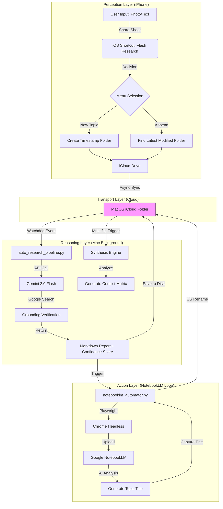

# 光速研究與全自動知識代謝系統：終極技術手冊 (Flash Research & Automated Knowledge Metabolism System: Master Technical Manual)

[繁體中文](#繁體中文) | [English](#english)

---

**版本**: v2.0 (最終發佈版)  
**狀態**: 已啟動並經驗證 (符合 17 層驗證規範)

這不僅是一套軟體，這是一套 **「擴增認知 (Augmented Cognition)」** 的基礎設施。它將您的 iPhone、Mac 與 Google 的 AI 算力無縫熔接，創造出一個只需「感知」即可完成「認知」的自動化閉環。

## 1. 核心使用流程 (The User Flow)

### 階段一：直覺式捕捉 (Perception)
**場景**：您在閱讀實體書、瀏覽網頁、或甚至是在散步時閃過一個靈感。
*   **動作**：
    1.  拿起 iPhone，選取文字或拍攝照片。
    2.  點擊「分享」按鈕 -> 選擇 **「光速研究」** 捷徑。
    3.  捷徑彈出選單（Haptic Feedback）：
        *   **【建立新研究】**：系統自動生成時間戳資料夾 (e.g., `2026-01-27_1505`)。
        *   **【加入最近研究】**：系統自動將素材注入您上一次操作的那個主題資料夾。
    4.  **結束**。手機震動一下，您把手機收回口袋。

### 階段二：隱形傳輸與緩衝 (Transport Strategy)
*   **機制**：資料透過 **iCloud Drive** 在背景靜默傳輸。
*   **優勢**：不需要 Mac 開機，不需要網路穩定。iCloud 充當了巨大的「非同步緩衝區 (Async Buffer)」。

### 階段三：自動化推理與生成 (Automatic Reasoning)
**場景**：您的 Mac 在家裡開機了，或者一直在背景運行。
*   **觸發**：`watchdog` 偵測到 iCloud 資料夾有新檔案落地。
*   **執行**：
    1.  **AI 閱讀**：Gemini 2.0 Flash 讀取圖片/PDF/文字。
    2.  **AI 查證**：Gemini 透過 Google Search 驗證內容的真實性 (Grounding)。
    3.  **報告產出**：
        *   生成 **Markdown 深度報告**。
        *   標註 **「信心評分 (Confidence Score)」**。
        *   若有多份文件，自動生成 **「爭議矩陣 (Conflict Matrix)」**。

### 階段四：語義閉環與知識歸檔 (Semantic Action Loop)
**這是本系統最核心的智慧展現。**
1.  **自動上傳**：系統喚醒背景瀏覽器，將報告餵給 **NotebookLM**。
2.  **語義命名**：NotebookLM 讀完後，自動生成一個精準的主題名稱 (e.g., "量子糾纏的商業趨勢")。
3.  **反向傳播 (Back-propagation)**：
    *   程式「抓取」這個 AI 名稱。
    *   **回頭修改** 您 Mac 裡的資料夾名稱 (`2026-01-27` -> `量子糾纏的商業趨勢`)。
    *   **結果**：您的硬碟被 AI 自動整理了。

---

**Version**: v2.0 (Final Release)  
**Status**: Active & Verified (17-Layer Compliance)

This is not just software; it is an **"Augmented Cognition"** infrastructure. It seamlessly fuses your iPhone, Mac, and Google's AI computing power to create an automated closed loop where "perception" leads directly to "cognition."

## 1. The User Flow

### Phase 1: Intuitive Capture (Perception)
**Scenario**: You are reading a physical book, browsing the web, or having a sudden flash of inspiration while walking.
*   **Action**:
    1.  Pick up your iPhone, select text, or take a photo.
    2.  Tap "Share" -> Select the **"Flash Research"** Shortcut.
    3.  Menu pops up (Haptic Feedback):
        *   **【Create New Research】**: System generates a timestamped folder (e.g., `2026-01-27_1505`).
        *   **【Append to Latest】**: System injects material into the folder of your last operation.
    4.  **Finish**. The phone vibrates, and you put it back in your pocket.

### Phase 2: Invisible Transport & Buffer (Transport Strategy)
*   **Mechanism**: Data is silently transmitted in the background via **iCloud Drive**.
*   **Advantage**: No Mac startup required; no stable internet needed. iCloud acts as a massive "Async Buffer."

### Phase 3: Automatic Reasoning & Generation (Automatic Reasoning)
**Scenario**: Your Mac is turned on at home or running in the background.
*   **Trigger**: `watchdog` detects new files landing in the iCloud folder.
*   **Execution**:
    1.  **AI Reading**: Gemini 2.0 Flash reads images/PDFs/text.
    2.  **AI Verification**: Gemini validates content authenticity via Google Search (Grounding).
    3.  **Report Output**:
        *   Generates a **Markdown Deep Report**.
        *   Labels with a **"Confidence Score"**.
        *   If multiple files exist, auto-generates a **"Conflict Matrix"**.

### Phase 4: Semantic Loop & Knowledge Archiving (Semantic Action Loop)
**This is the core intelligence of the system.**
1.  **Auto Upload**: System wakes a background browser to feed the report to **NotebookLM**.
2.  **Semantic Naming**: After reading, NotebookLM auto-generates a precise topic name (e.g., "Business Trends of Quantum Entanglement").
3.  **Back-propagation**:
    *   The script "captures" this AI-generated title.
    *   **Renames** the folder on your Mac (`2026-01-27` -> `Business Trends of Quantum Entanglement`).
    *   **Result**: Your hard drive is automatically organized by AI.

---

## 2. 系統架構圖 (System Architecture)

---

## 3. 技術細節與規格 (Technical Specifications)

### A. 核心程式 (Core Engine)
*   **Path**: `scripts/auto_research_pipeline.py`
*   **Language**: Python 3.9+
*   **Libraries**: `google-genai`, `watchdog`, `python-dotenv`.

### B. 安全協定 (Security Protocol)
*   **Data Sovereignty**: Uses a **Local-First** architecture. All raw files and reports are stored on the user's iCloud and local disk, never passing through third-party servers.

---

> *"The computer should do the work, you should do the thinking."*
