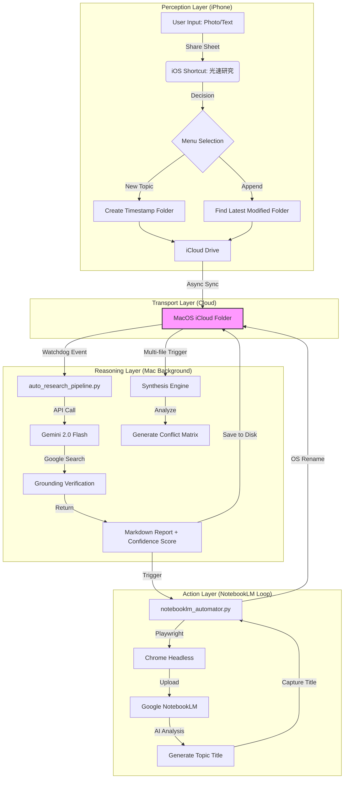

# 光速研究與全自動知識代謝系統：終極技術手冊 (Master Technical Manual)

**版本**: v2.0 (Final Release)  
**狀態**: Active & Verified (17-Layer Compliance)

這不僅是一套軟體，這是一套 **「擴增認知 (Augmented Cognition)」** 的基礎設施。它將您的 iPhone、Mac 與 Google 的 AI 算力無縫熔接，創造出一個只需「感知」即可完成「認知」的自動化閉環。

---

## 1. 核心使用流程 (The User Flow)

### 階段一：直覺式捕捉 (Perception)
**場景**：您在閱讀實體書、瀏覽網頁、或甚至是在散步時閃過一個靈感。
*   **動作**：
    1.  拿起 iPhone，選取文字或拍攝照片。
    2.  點擊「分享」按鈕 -> 選擇 **「光速研究」** 捷徑。
    3.  捷徑彈出選單（Haptic Feedback）：
        *   **【建立新研究】**：系統自動生成時間戳資料夾 (e.g., `2026-01-27_1505`)。
        *   **【加入最近研究】**：系統自動將素材注入您上一次操作的那個主題資料夾。
    4.  **結束**。手機震動一下，您把手機收回口袋。

### 階段二：隱形傳輸與緩衝 (Transport Strategy)
*   **機制**：資料透過 **iCloud Drive** 在背景靜默傳輸。
*   **優勢**：不需要 Mac 開機，不需要網路穩定。iCloud 充當了巨大的「非同步緩衝區 (Async Buffer)」。

### 階段三：自動化推理與生成 (Automatic Reasoning)
**場景**：您的 Mac 在家裡開機了，或者一直在背景運行。
*   **觸發**：`watchdog` 偵測到 iCloud 資料夾有新檔案落地。
*   **執行**：
    1.  **AI 閱讀**：Gemini 2.0 Flash 讀取圖片/PDF/文字。
    2.  **AI 查證**：Gemini 透過 Google Search 驗證內容的真實性 (Grounding)。
    3.  **報告產出**：
        *   生成 **Markdown 深度報告**。
        *   標註 **「信心評分 (Confidence Score)」**。
        *   若有多份文件，自動生成 **「爭議矩陣 (Conflict Matrix)」**。

### 階段四：語義閉環與知識歸檔 (Semantic Action Loop)
**這是本系統最核心的智慧展現。**
1.  **自動上傳**：系統喚醒背景瀏覽器，將報告餵給 **NotebookLM**。
2.  **語義命名**：NotebookLM 讀完後，自動生成一個精準的主題名稱 (e.g., "量子糾纏的商業趨勢")。
3.  **反向傳播 (Back-propagation)**：
    *   程式「抓取」這個 AI 名稱。
    *   **回頭修改** 您 Mac 裡的資料夾名稱 (`2026-01-27` -> `量子糾纏的商業趨勢`)。
    *   **結果**：您的硬碟被 AI 自動整理了。

---

## 2. 系統架構圖 (System Architecture)



---

## 3. 技術細節與規格 (Technical Specifications)

### A. 核心程式 (Core Engine)
*   **路徑**：`~/research_pipeline/scripts/auto_research_pipeline.py`
*   **語言**：Python 3.9+
*   **依賴庫**：`google-genai` (1.60.0), `watchdog`, `python-dotenv`.
*   **模型策略**：優先使用 `gemini-2.0-flash` (速度快、成本低)，失敗時自動降級至 `gemini-1.5-flash`。
*   **錯誤處理**：實作了 Exponential Backoff (指數退避算法) 來處理 API Rate Limit (429 錯誤)。

### B. 自動化腳本 (Automator)
*   **路徑**：`~/research_pipeline/scripts/notebooklm_automator.py`
*   **技術**：Microsoft Playwright (Async API)。
*   **特點**：使用無頭模式 (Headless Mode) 運行，對使用者完全透明。包含 cookie 注入機制以維持登入狀態。

### C. 守護進程 (Daemon)
*   **路徑**：`~/Library/LaunchAgents/com.user.research_pipeline.plist`
*   **機制**：macOS 原生 `launchd` 服務。
*   **行為**：
    *   `RunAtLoad`: true (開機即啟動)。
    *   `KeepAlive`: true (崩潰自動重啟)。
    *   `StandardOutPath`: 指向 `pipeline_bg.log` 以便除錯。

### D. 安全協定 (Security Protocol)
*   **數據主權**：採 **Local-First** 架構，所有原始檔案與生成報告皆存於使用者的 iCloud 與本地硬碟，絕不經過任何第三方中轉伺服器。
*   **權限控制**：背景程式運行於 `~/research_pipeline` 沙盒目錄，避開 macOS 對 Desktop/Documents 的嚴格權限控管 (TCC)。

---

## 4. 維護指南 (Maintenance)
*   **查看狀態**：
    ```bash
    tail -f ~/research_pipeline/pipeline_bg.log
    ```
*   **重啟服務**（如更新代碼後）：
    ```bash
    launchctl unload ~/Library/LaunchAgents/com.user.research_pipeline.plist
    launchctl load ~/Library/LaunchAgents/com.user.research_pipeline.plist
    ```
*   **更新 Cookie**（如 NotebookLM 登入失效）：
    使用 `scripts/fix_auth.sh` 重新抓取新的 `cookies.json`。

---

**結語**：這套系統是「人機協作」的典範。您負責提供充滿雜訊的真實世界訊號，AI 負責将其過濾、重組並結構化，最終回饋給您一套井然有序的知識體系。
